<p align="center"></p>
<h2 align="center">简洁优雅 · 稳定高效 | 宁静致远 · 精益求精 </h2>
<p align="center">“一套代码、两种架构，可以灵活切换微服务和单体两种架构”的企业级云原生微服务基座</p>

---

<p align="center">
    <a href="https://spring.io/projects/spring-boot" target="_blank"></a>
    <a href="https://spring.io/projects/spring-cloud" target="_blank"></a>
    <a href="https://github.com/alibaba/spring-cloud-alibaba" target="_blank"></a>
    <a href="https://github.com/Tencent/spring-cloud-tencent" target="_blank"></a>
    <a href="https://nacos.io/zh-cn/index.html" target="_blank"></a>
</p>
<p align="center">
    <a href="#" target="_blank"></a>
    <a href="https://gitee.com/dromara/dante-cloud/issues/IDKCZD" target="_blank"></a>
    <a href="https://bell-sw.com/pages/downloads/#downloads" target="_blank"></a>
    <a href="./LICENSE"></a>
    <a href="https://blog.csdn.net/Pointer_v" target="_blank"></a>
    <a href="https://github.com/dromara/dante-cloud"></a>
    <a href="https://github.com/dromara/dante-cloud"></a>
    <a href="https://gitee.com/dromara/dante-cloud"></a>
    <a href="https://gitee.com/dromara/dante-cloud"></a>
    <a href='https://gitcode.com/dromara/dante-cloud'></a>
</p>
<p align="center">
    <a href="https://gitcode.com/dromara/dante-cloud">GitCode 仓库</a> &nbsp; | &nbsp;
    <a href="https://github.com/dromara/dante-cloud">Github 仓库</a> &nbsp; | &nbsp;
    <a href="https://gitee.com/dromara/dante-cloud">Gitee 仓库</a> &nbsp; | &nbsp;
    <a href="https://www.herodotus.vip">在线文档</a>
</p>

<h1 align="center"> 如果您觉得有帮助，请点右上角 "Star" 支持一下，谢谢！</h1>

---

## 企业级技术中台与云原生微服务基座

**Dante Cloud** 国内首个支持阻塞式和响应式服务并行的、开箱即用的企业级云原生微服务基座。是采用**领域驱动模型(DDD)**设计思想，以「**高质量代码、低安全漏洞**」为核心，基于 Spring 生态全域开源技术，高度**模块化和组件化设计**，支持**智能电视、IoT等物联网设备**认证，满足**国家三级等保要求**，支持**接口国密数字信封加解密**等一系列安全体系的一站式多租户微服务解决方案。独创的可以“**一套代码实现微服务和单体两种架构灵活切换**”的企业级应用系统。

### 一、项目理念

**Dante Cloud** 一直秉承着“简洁、高效、包容、务实”的理念，使用微服务领域及周边相关的各类新兴技术或主流技术进行建设，不断地深耕细作、去粗取精、用心打造。目标是构建一款`代码质量高、维护投入低、安全防护强`的微服务基座，可以帮助用户快速跨越架构技术选型、技术研究探索、基础架构搭建阶段，直接聚焦业务开发。极大地降低传统项目中因安全漏洞、技术负债、低质代码等潜在隐患所产生的高维护投入。期望像项目名字寓意一样，构建一套可以在在行业变革的时期承上启下，助力企业信息化建设和数字化转型的产品。

**Dante Cloud** 核心关注点是：**「高质量的系统代码」**、**「合理的系统架构」**、**「低耦合的模块划分」**、**「高安全性系统实现」**、**「灵活的功能扩展能力」**，**「优质的微服务方案」**。不会像其它一些系统一样，追求 **业务功能** 的 **丰富** 性。堆叠大量无法做到真正通用的功能，反倒会成为负担和干扰，不如由用户自己按照需求灵活设计和实现。

### 二、架构设计

**Dante Cloud** 优秀的模块化能力，为系统提供了高度灵活的配置能力、**功能的“可插拔”能力** 以及不同需求场景的适配能力。正因为优秀的模块化体系，使得 **Dante Cloud** 不仅是一套完整的微服务架构，还是一套高质量的 **「单体模块化」** 系统。这里的微服务架构和单体架构并不是分离的两套代码，也不是分离的两个项目。而是完全融合的一整套代码，使用时可以根据需要选择是以微服务模式或者单体模式运行，配合灵活的模块能力，实现系统的多样化定制和功能的管控。

这是 Dante Cloud 微服务最大的特色之一：**“一套代码、两种架构”**。可以帮助企业在项目早期以单体架构快速建设项目、方便开发人员在本地进行开发以及新技术研究。在项目后期随着用户规模增大以及并发需求提升时，可以快速无缝迁移至微服务架构。

### 三、适用用户

微服务技术并不是 **「落伍」**了，而是进入了 **「成熟期」**，它的 **「适用场景和边界被更清晰地定义」** 了。微服务不再是一个 **「必须要有」** 的选项，而是一个 **「权衡之后」** 的选择。

**Dante Cloud** 也并未使用任何复杂难懂或难以上手掌握的技术，项目中所涉及核心关键组件中，其中 **「近 80% 均为 Spring 生态原生组件」**。技术实现均为各组件标准用法的组合与应用，编码风格和代码设计一直也在极尽努力尽量与 Spring 生态的标准规范用法保持一致，只不过经过大量的版本迭代和重构之后逐渐形成了一定的封装与抽象。

因此，我们推荐以下用户选择和使用 **Dante Cloud**

- **「传统项目用户」**：可以先体验和使用单体版，先从“前后端分离”以及“多端适配”开始，尝试不同于传统内嵌页面的开发模式。之后也可以平滑迁移至微服务版。
- **「数字转型用户」**：如果您正在考虑进行数字化转型，可以直接选择使用微服务版，不用再为“基础组件碎片化，需花大量时间整合、踩坑版本兼容”等问题而苦恼。
- **「复杂项目用户」**：如果您的业务复杂度上升到一定阶段，可以直接选择使用微服务版，直接聚焦于业务开发，节省大量前期搭建基础设施、解决通用技术问题的时间。
- **「初创团队用户」**：可以先使用单体版进行开发，只要代码放置规范、模块划分合理，后期可以根据需要无缝迁移至微服务架构
- **「技术突破用户」**：本项目并不拘泥局限于常规成熟的技术内容，目标是探索新型技术并用其来为业务的创新服务。喜欢技术尝鲜和突破的用户推荐选择使用。
- **「学习提升用户」**：本项目代码实现优雅和领域划分清晰，编码风格和模块实现尽最大可能与 Spring 生态规范保持一致，是深入学习 Spring 生态组件和提升技能的优秀案例

> 想要从传统项目转型至微服务项目的用户，**建议详细阅读《企业IT架构转型之道：阿里巴巴中台战略思想与架构实战》一书（可以先读前几章）之后再上手本项目！**

对于以下用户我们不建议选择 **Dante Cloud**

- **「单体拥趸用户」**：如果您觉得单体架构可以满足您所有的架构需求，微服务繁琐庞大无法比拟单体的“方便”、“快捷”，那么建议选择其它更专业的单体项目。
- **「单一前端用户」**：如果您的项目只会有Web端，不会涉及小程序、移动端、桌面端等其它类型终端，未来也不需要考虑并发或者扩展等问题，选择本项目大材小用。
- **「主流技术用户」**：如果您只擅长 mysql、mybatis 等主流技术，本项目所涉及的基础技术体系可能会让您觉得格格不入，建议选择更适配您技术体系项目。
- **「功能丰富用户」**：本项目定位是基础平台，自认为没有能力做到功能既丰富又通用，如果您追求拥有丰富的、开箱即用的功能后台系统，那么本项目并不适合。
- **「极简编程用户」**：如果您希望基于已有知识不看文档不用学习就可以快速搭建应用，或者通过拖拽生成代码简化开发，这与本项目的产品定位、开发理念、设计哲学背道而驰。
- **「审美品鉴用户」**：本项目前端是使用组件库纯手搓构建，没有专业的美工也没有照搬主流框架，初衷是为后端开发人员接触前端提供一条更友好的途径，所以不能保证符合您的审美。

## [1]、安全测试

Dante Cloud 已通过由第三方进行的软件出厂安全测试以及等保测试。详情参见：[安全测试说明](https://www.herodotus.vip/guide/security/compliance.html)

## [2]、总体架构

<p align="center">
  
</p>

## [3]、功能展示

### （1） Passkey 通用密钥「无密码」登录

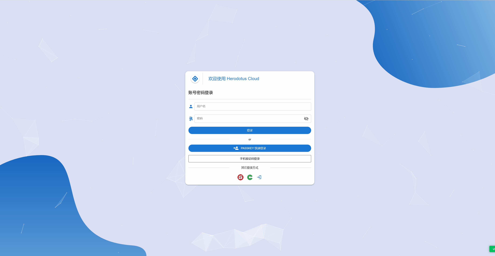

### （2） 方法级动态权限

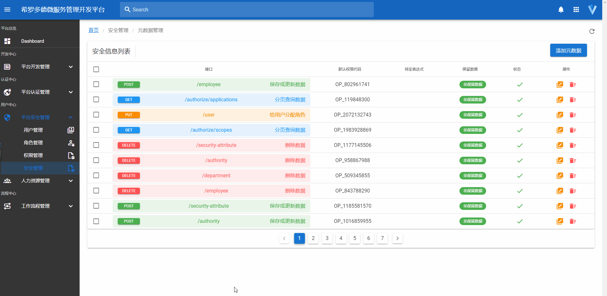

### （3） Minio 控制台使用 Dante Cloud 登录认证


### （4） 服务调用链监控


## [4]、工程结构

### 1. 主工程结构

```shell
herodotus-cloud
├── configurations -- 配置文件脚本和统一Docker build上下文目录
├── herodotus-cloud-dependencies -- 工程 Bom 定义，统一管理工程模块
├── herodotus-cloud-module -- “半成品”组件模块分组(可以再此建立业务代码模块，以模块的形式实现代码的共享以及架构的切换)
├    ├── herodotus-module-common -- 微服务版公共辅助代码模块
├    └── herodotus-monomer-autoconfigure -- 单体版自动配置模块
├── herodotus-cloud-packages -- 服务基础核心 Starter
├    ├── authentication-spring-boot-starter -- OAuth2 授权服务器自动配置 Starter(主要用于微服务版和单体版统一认证)
├    ├── authorization-reactive-spring-boot-starter -- 响应式 OAuth2 资源服务器自动配置 Starter(除了 Monitor 等特殊服务以外，所有响应式服务均需依赖)
├    ├── authorization-servlet-spring-boot-starter -- 阻塞式 OAuth2 资源服务器自动配置 Starter(除了 Monitor 等特殊服务以外，所有阻塞式服务均需依赖)
├    ├── facility-spring-boot-starter -- 基础设施切换依赖 Starter(用于切换 Alibaba、Tencent和原生微服务基础设施环境)
├    ├── rpc-client-oss-spring-boot-starter -- 服务间通信客户端自动配置 Starter(OSS 作为客户端访问其它服务)
├    ├── rpc-client-uaa-spring-boot-starter -- 服务间通信客户端自动配置 Starter(UAA 作为客户端访问其它服务)
├    └── rpc-server-upms-spring-boot-starter -- 服务间通信服务端自动配置 Starter(UPMS 作为服务端为其它服务提供访问)
├── herodotus-cloud-platform -- 平台核心服务
├    ├── herodotus-cloud-gateway -- 统一网关服务
├    ├── herodotus-cloud-message -- 平台消息服务
├    ├── herodotus-cloud-monitor -- Spring Boot Admin 监控服务
├    ├── herodotus-cloud-uaa -- 账户管理和统一认证模块
├    └── herodotus-cloud-upms -- 统一权限管理系统服务
├── herodotus-cloud-services -- 平台业务服务
├    ├── herodotus-cloud-bpmn-ability -- 工作流服务
├    ├── herodotus-cloud-manage-ability -- 平台管理服务
├    ├── herodotus-cloud-oss-ability -- 对象存储服务
└──  └── herodotus-monomer-application -- Herodotus Cloud 单体版应用启动模块
```

### 2. 组件库结构

```shell
herodotus-stirrup
├── readme -- README 相关素材放置目录
├── stirrup-assistant -- 辅助功能模块
├    ├── stirrup-assistant-access -- 第三方登录接入辅助功能模块
├    ├── stirrup-assistant-captcha -- 验证码辅助功能模块
├    ├── stirrup-assistant-ip2location -- 离线IP地址定位辅助功能模块
├    ├── stirrup-assistant-oss -- AWS SDK V2 对象存储辅助功能模块
├    ├── stirrup-assistant-pki -- 证书管理辅助功能模块
├    ├── stirrup-assistant-rules -- 轻量级规则引擎功能模块
├    └── stirrup-servlet-service-archetype -- 阻塞式类型服务创建 Archetype
├── stirrup-cache -- 缓存功能模块
├    ├── stirrup-cache-caffeine -- Caffeine 缓存功能封装模块
├    ├── stirrup-cache-commons -- 缓存通用代码模块
├    ├── stirrup-cache-jetcache -- JetCache 缓存功能封装模块
├    └── stirrup-cache-redis -- Redis 缓存功能封装模块
├── stirrup-data -- 数据访问模块
├    ├── stirrup-data-cassandra -- 以 Cassandra 作为数据访问层的通用代码模块
├    ├── stirrup-data-commons -- 数据访问通用代码模块
├    ├── stirrup-data-jpa -- 以 JPA 作为数据访问层的通用代码模块
├    ├── stirrup-data-mongodb -- 以 MongoDB 作为数据访问层的通用代码模块
├    ├── stirrup-data-redis -- 以 Redis 作为数据访问层的通用代码模块
├    └── stirrup-data-rest --  REST 通用代码模块
├── stirrup-dependencies -- Stirrup Bom 定义，统一管理工程模块
├── stirrup-framework -- Stirrup 框架核心基础模块
├    ├── stirrup-autoconfigure -- 基础自动配置模块
├    ├── stirrup-core -- 核心定义模块
├    ├── stirrup-hibernate -- Hibernate 扩展模块
├    ├── stirrup-security -- Security 相关基础代码模块
├    ├── stirrup-spring -- SpringBoot 相关基础代码模块
├    └── stirrup-web -- Web 服务 相关基础代码模块
├── stirrup-grpc -- gRPC 定义模块
├    ├── stirrup-grpc-oss -- gRPC 对象存储定义模块
├    └── stirrup-grpc-user -- gRPC 用户定义模块
├── stirrup-logic -- 系统内置功能业务逻辑模块
├    ├── stirrup-logic-bpmn -- 工作流业务逻辑模块
├    ├── stirrup-logic-client-jpa -- Spring Security OAuth2 Client 基于 JPA 的存储功能逻辑模块
├    ├── stirrup-logic-identity -- 身份认证功能业务逻辑模块
├    ├── stirrup-logic-manage -- 系统管理功能业务逻辑模块
├    ├── stirrup-logic-message -- 系统消息业务逻辑模块
├    └── stirrup-logic-upms -- UPMS 业务逻辑模块
├── stirrup-message -- 消息模块
├    ├── stirrup-message-autoconfigure -- 消息自动配置模块
├    ├── stirrup-message-commons -- 消息通用代码模块
├    ├── stirrup-message-emqx -- emqx 功能封装模块
├    ├── stirrup-message-reactive-websocket -- 基于 Reactive 环境下的 Websocket 功能封装模块
├    └── stirrup-message-servlet-websocket -- 基于 Servlet 环境下的 Websocket 功能封装模块
├── stirrup-nosql -- 非结构化数据存储模块
├    ├── stirrup-nosql-clickhouse -- ClickHouse 封装模块
├    ├── stirrup-nosql-influxdb2 -- InfluxDB 2.X 封装模块
├    └── stirrup-nosql-tdengine -- TDengine 封装模块
├── stirrup-oauth2 -- OAuth2 认证模块
├    ├── stirrup-authentication-autoconfigure -- OAuth2 授权服务器基础内容自动配置模块
├    ├── stirrup-authorization-autoconfigure -- OAuth2 资源服务器基础内容自动配置模块
├    ├── stirrup-oauth2-authentication -- Spring Authorization Server 授权服务器核心功能封装模块
├    ├── stirrup-oauth2-authorization -- Spring Authorization Server 资源服务器核心功能封装模块
├    ├── stirrup-oauth2-client -- Spring Security OAuth2 Client 核心功能封装模块
├    ├── stirrup-oauth2-commons -- OAuth2 通用代码模块
├    └── stirrup-oauth2-extension -- Spring Authorization Server 功能扩展模块
├── stirrup-openapi -- 第三方 OpenApi 封装模块
├    ├── stirrup-openapi-commons -- Openapi 通用代码模块
├    ├── stirrup-openapi-emqx -- Emqx Open API 封装集成模块
├    └── stirrup-openapi-nacos -- Nacos Open API 封装集成模块
├── stirrup-persistence -- 数据存储层模块
├    ├── stirrup-persistence-commons -- 数据存储通用代码模块
├    ├── stirrup-persistence-sas-autoconfigure -- SAS 核心数据访问层模块自动配置
├    ├── stirrup-persistence-sas-jpa -- 以 JPA 作为 SAS 核心数据访问层代码实现模块
├    ├── stirrup-persistence-sas-mongodb -- 以 MongoDB 作为 SAS 核心数据访问层代码实现模块
├    ├── stirrup-persistence-sas-redis -- 以 Redis 作为 SAS 核心数据访问层代码实现模块
├    ├── stirrup-persistence-sys-autoconfigure -- 系统审计数据访问层模块自动配置
├    ├── stirrup-persistence-sys-cassandra -- 以 Cassandra 作为系统审计数据访问层代码实现模块
├    └── stirrup-persistence-sys-jpa -- 以 JPA 作为系统审计数据访问层代码实现模块
├── stirrup-rest -- 系统内置功能 REST 接口模块
├    ├── stirrup-rest-manage -- 系统管理功能兼容 Reactive 和 Servlet 环境 REST 接口模块
├    ├── stirrup-rest-message -- 消息功能兼容 Reactive 和 Servlet 环境 REST 接口模块
├    ├── stirrup-rest-nacos -- Nacos 管理功能兼容 Reactive 和 Servlet 环境 REST 接口模块
├    ├── stirrup-rest-oss -- 对象存储功能兼容 Reactive 和 Servlet 环境 REST 接口模块
├    ├── stirrup-rest-servlet-identity -- 身份认证功能 Servlet 环境 REST 接口模块
├    └── stirrup-rest-servlet-upms -- UPMS 功能 Servlet 环境 REST 接口模块
├── stirrup-starter -- Starters
├    ├── cache-spring-boot-starter -- 缓存自动配置 Starter
├    ├── captcha-spring-boot-starter -- 验证码自动配置 Starter
├    ├── data-cassandra-spring-boot-starter -- Cassandra 数据库数据访问层自动配置 Starter
├    ├── data-mongodb-spring-boot-starter -- MongoDB 数据访问层自动配置 Starter
├    ├── data-rdbms-spring-boot-starter -- 关系型数据库数据访问层自动配置 Starter
├    ├── facility-alibaba-spring-boot-starter -- 面向 Spring Cloud Alibaba 的微服务基础设施适配 Starter
├    ├── facility-gateway-spring-boot-starter -- Alibaba Sentinel 在 Gateway 环境下基础设施适配 Starter
├    ├── facility-kafka-spring-boot-starter -- 基于 Kafka 的消息事件自动配置 Starter
├    ├── facility-original-spring-boot-starter -- 面向 Spring Cloud 原生全家桶的微服务基础设施适配 Starter
├    ├── facility-tencent-spring-boot-starter -- 面向 Spring Cloud Tencent 的微服务基础设施适配模块 Starter
├    ├── fegin-client-spring-boot-starter -- Feign 客户端自动配置 Starter
├    ├── grpc-client-spring-boot-starter -- 基于 Spring gRPC 扩展的 gRPC 客户端自动配置 Starter(支持服务发现)
├    ├── grpc-server-spring-boot-starter -- 基于 Spring gRPC 扩展的 gRPC 服务端自动配置 Starter(支持服务发现)
├    ├── logging-spring-boot-starter -- 日志收集和聚合自动配置 Starter
├    ├── manage-spring-boot-starter -- 系统管理功能自动配置 Starter
├    ├── message-mail-sring-boot-starter -- 电子邮件消息自动配置 Starter
├    ├── message-mqtt-spring-boot-starter -- 基于 Mqtt 消息自动配置 Starter
├    ├── micrometer-spring-boot-starter -- 链路追踪及度量配置自动配置 Starter
├    ├── nosql-spring-boot-starter -- NoSQL 相关组件自动配置配置 Starter
├    ├── oauth2-client-spring-boot-starter -- Spring Security OAuth2 客户端自动配置 Starter
├    ├── oss-spring-boot-starter -- 基于 AWS SDK V2 兼容 Reactive 和 Servlet 环境的对象存储自动配置 Starter
├    ├── reactive-container-spring-boot-starter -- Reactive 容器基础配置自动配置 Starter
├    ├── reactive-message-spring-boot-starter -- Reactive 环境消息模块自动配置 Starter
├    ├── servlet-container-spring-boot-starter -- Servlet 容器基础配置自动配置 Starter
├    ├── servlet-message-spring-boot-starter -- Servlet 环境消息模块自动配置 Starter
├    ├── tenant-spring-boot-starter -- 基于 JPA 的多租户自动配置 Starter
├    ├── web-spring-boot-starter -- Web通用内容自动配置 Starter
├    ├── webmvc-spring-boot-starter -- WebMvc 类型应用自动配置 Starter
├    └── webflux-spring-boot-starter -- WebFlux 类型应用自动配置 Starter
├── stirrup-transform -- 数据迁移转换集成模块
├    ├── stirrup-transform-bpmn -- 系统用户体系与 BPMN 用户体系数据同步模块
└──  └── stirrup-transform-emqx -- 基于 Spring Integration 的 Emqx 数据集成模块
```

## [5]、 版本和分支

### 一、版本号说明

本系统版本号，分为四段。

- 第一段和第二段，与 Spring Boot 版本对应，根据采用的 Spring Boot 版本变更。例如，当前采用 Spring Boot 2.4.6 版本，那么就以
  2.4.X.X 开头
- 第三段，表示系统功能的变化
- 第四段，表示系统功能维护及优化情况

### 二、分支说明

|        分支名称        | 对应 Spring 生态版本                     | 对应 JDK 版本 | 用途               | 现状                                                                                           |
| :--------------------: | ---------------------------------------- | ------------- | ------------------ | ---------------------------------------------------------------------------------------------- |
|         master         | Spring Boot 4.0 和 Spring Cloud 2025.1.X | JDK 25        | 主要发布分支       | 推荐使用代码分支                                                                               |
|        develop         | Spring Boot 4.0 和 Spring Cloud 2025.1.X | JDK 25        | Development 分支   | 新功能、ISSUE 均以此分支作为开发，发布后会 PR 至 master 分支                                   |
|         3.5.X          | Spring Boot 3.5 和 Spring Cloud 2025.0.X | JDK 17        | 历史版本，停止维护 | 基于 Spring Boot 3.5 时代开发的代码分支，稳定可用，不再维护                                    |
|         3.4.X          | Spring Boot 3.4 和 Spring Cloud 2024.0.X | JDK 17        | 历史版本，停止维护 | 基于 Spring Boot 3.4 时代开发的代码分支，稳定可用，不再维护                                    |
|      3.2.X-3.3.X       | Spring Boot 3.3 和 Spring Cloud 2023.0.X | JDK 17        | 历史版本，停止维护 | 基于 Spring Boot 3.3 时代开发的代码分支，稳定可用，不再维护                                    |
|         3.1.X          | Spring Boot 3.1 和 Spring Cloud 2022.0.X | JDK 17        | 历史版本，停止维护 | 基于 Spring Boot 3.1 时代开发的代码分支，稳定可用，不再维护                                    |
|         2.7.X          | Spring Boot 2.7 和 Spring Cloud 2021.0.X | JDK 8         | 历史版本，停止维护 | 基于 Spring Boot 2.7 时代开发的代码分支，稳定可用，不再维护                                    |
| spring-security-oauth2 | Spring Boot 2.6 和 Spring Cloud 2021.0.X | JDK 8         | 历史代码，不再维护 | 基于原 Spring Security OAuth2 实现的微服务，稳定可用，因相关组件均不在维护，所以该版本不再维护 |

## [6]、如何升级

尽量不修改 Dante Cloud 以外的项目源码，如 Dante Engine、Dante OSS。如果修改了，请 Pull Requests 上来，否则代码与官方不同步，可能会将对你的日后升级增加难度。

每个版本升级，我们都会附带详细更新日志：<https://dante-cloud.dromara.org/others/log/changelog.html> 在这里，你可以看到 Dante Cloud 新增哪些新功能和改进。
针对有较大变化、差异的版本，我们都会负载详细的升级指南：<https://dante-cloud.dromara.org/guide/get-start/notices.html> 在这里，你可以看到 Dante Cloud 不同版本对应升级方法。

## [7]、界面预览

<table>
    <tr>
        <td>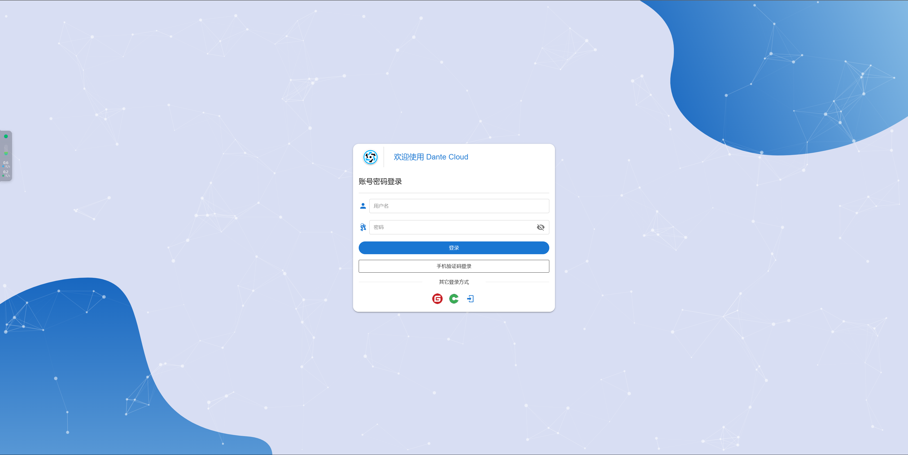</td>
        <td>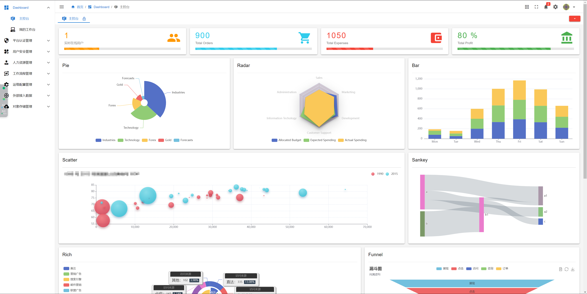</td>
        <td>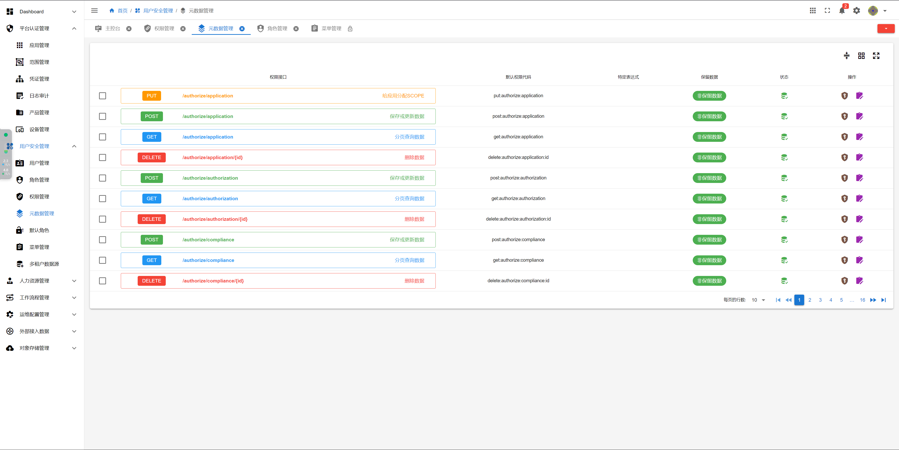</td>
    </tr>
    <tr>
        <td></td>
        <td>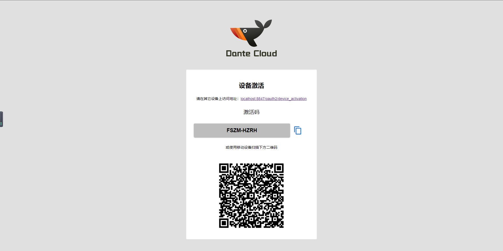</td>
        <td></td>
    </tr>
    <tr>
        <td></td>
        <td>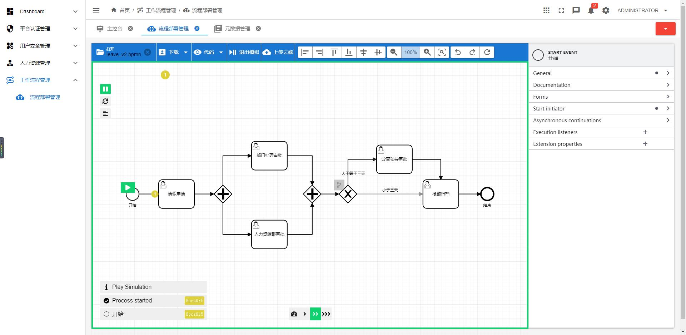</td>
        <td></td>
    </tr>
    <tr>
        <td>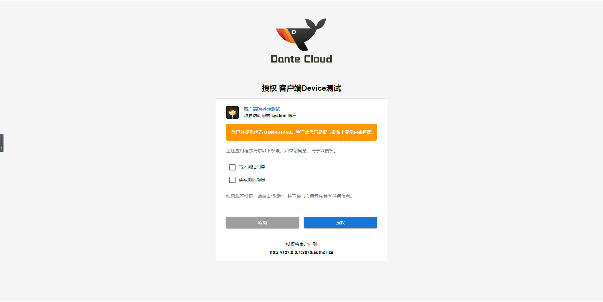</td>
        <td></td>
        <td>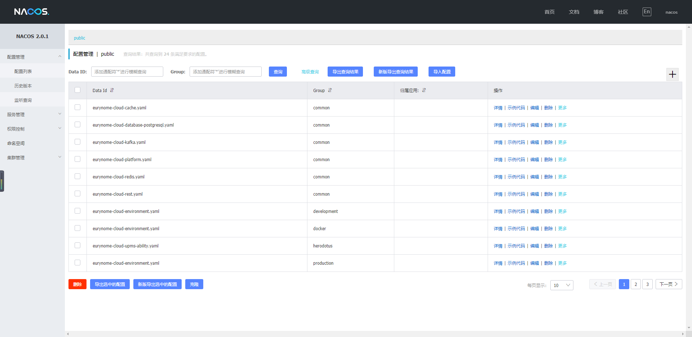</td>
    </tr>
    <tr>
        <td>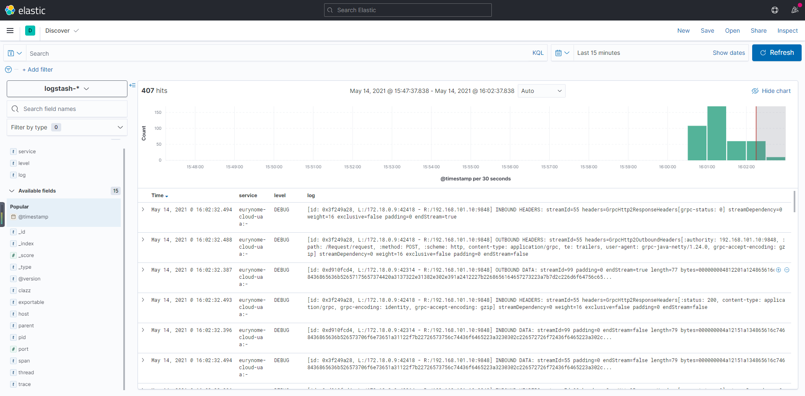</td>
        <td>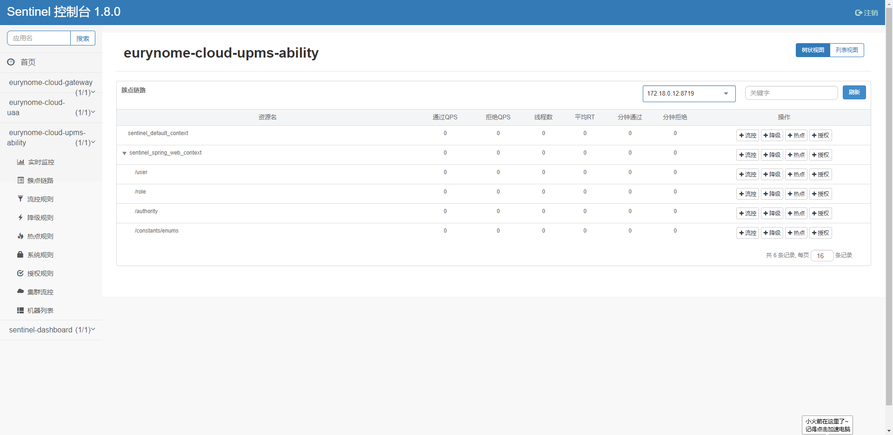</td>
        <td>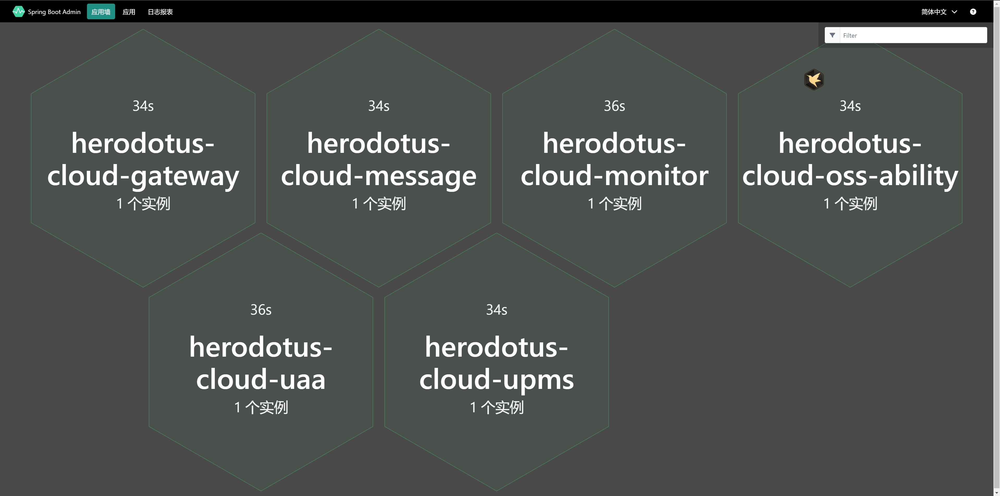</td>
    </tr>
    <tr>
        <td>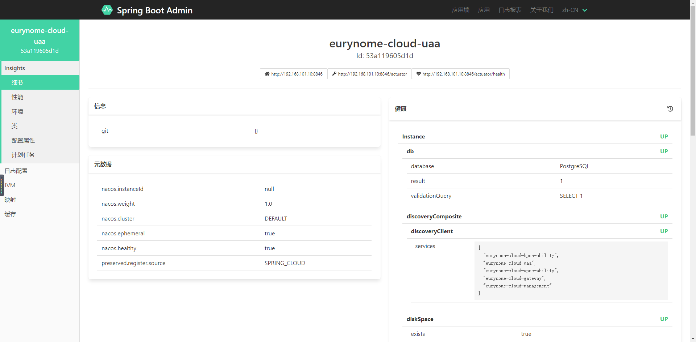</td>
        <td></td>
        <td></td>
    </tr>
    <tr>
        <td>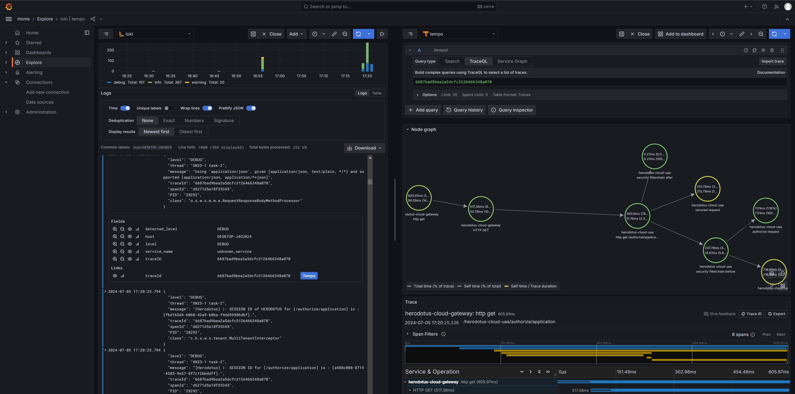</td>
        <td>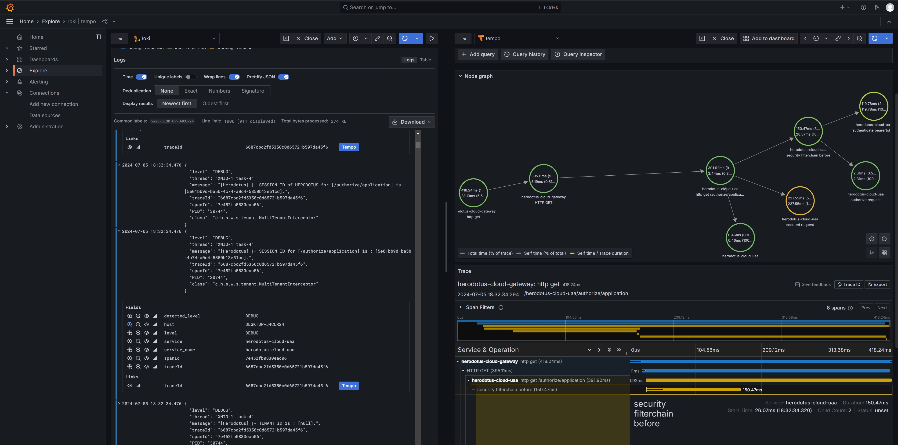</td>
        <td>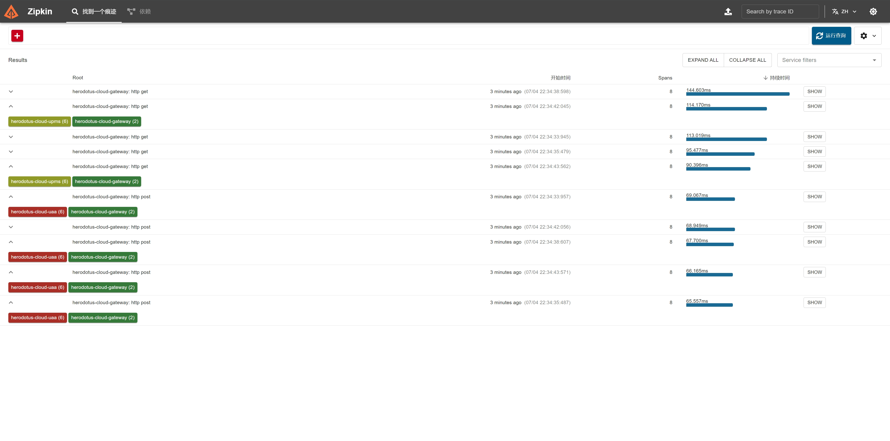</td>
    </tr>
    <tr>
        <td></td>
        <td>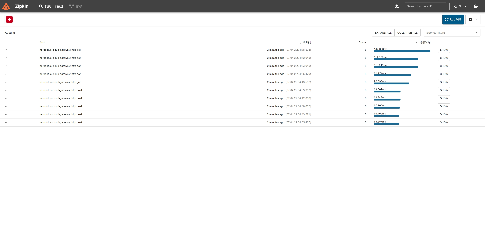</td>
        <td>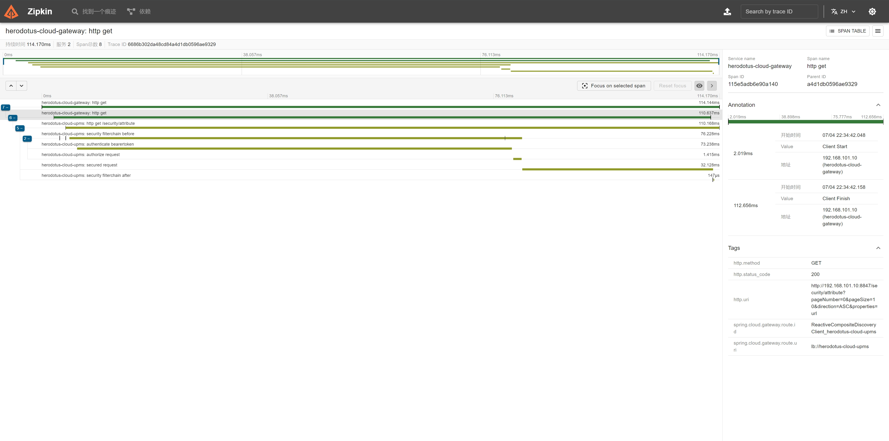</td>
    </tr>
</table>
